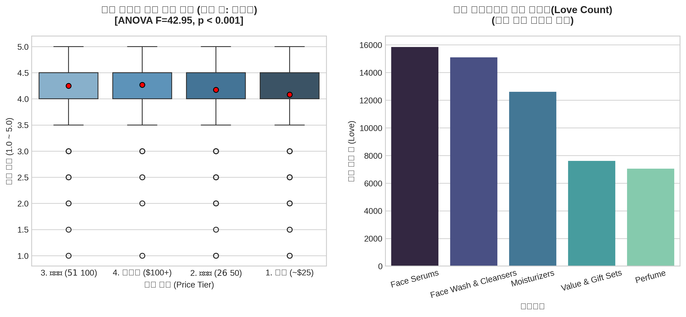

# 💄 Sephora E-Commerce Pricing & Customer Satisfaction Analytics

> **세포라 웹사이트 데이터를 활용한 가격 티어별 고객 만족도 분석 및 One-way ANOVA 통계 가설 검정**

---

## 📌 1. Project Overview
* **분석 배경**: 이커머스 환경에서 제품 가격이 높을수록 고객 평점이 비례하여 상승하는지 데이터로 검증하고 최적의 가격 세그먼트 도출
* **데이터 규모**: 총 9,168건 중 미평가 신제품(평점 0.0 노이즈) 398건을 정제한 **8,770건의 유효 데이터**
* **핵심 방법론**: 4단계 가격 티어링(저가/중저가/중고가/럭셔리), 일원배치 분산분석(One-way ANOVA)

---

## 📊 2. Statistical Evidence & Visualizations

### 🔍 핵심 통계 검정 결과 (ANOVA)
* **검정 통계량**: $F\text{-statistic} = 42.95$
* **유의확률 ($p$-value)**: $1.5262 \times 10^{-27}$ ($p < 0.001$)
* **통계적 결론**: 가격 구간에 따른 고객 평점 차이는 우연이 아니며, 통계적으로 매우 유의미한 차이가 존재함.

---

## 💡 3. Key Business Insights
* **가성비 스윗스팟 발견**: 럭셔리($100+) 티어 외에도 $26~$50 중저가 구간에서 매우 견고한 평점 방어율 관측
* **관심도(Love) 비대칭성**: 등록 상품 수(SKU)가 많은 기초 제품군보다 색조/향수 등 고관여 카테고리에서 평균 고객 관심도(하트 수)가 집중됨

---

## 🚀 4. Actionable Strategies
1. **MD 소싱 전략**: 고객 불만 리스크를 최소화하면서 객단가를 방어할 수 있는 $26~$50 인디 뷰티 브랜드 라인업 확대
2. **리뷰 프로모션**: 관심도(Love)는 높으나 리뷰 수가 저조한 잠재 인기 상품군 대상 첫 리뷰 포인트 프로모션 집중 집행
